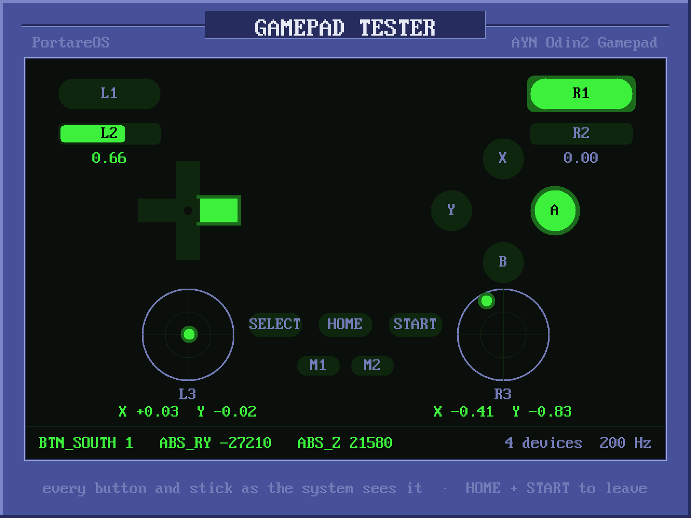

# Gamepad tester

A tool of our own to replace the SDL GamepadTester the image ships today,
which needs SDL2_gfx and a controller database and looks like nothing else
on the device. This one is a second binary in this repository, built from
the launcher's own pieces: `kms.c` for the panel, the evdev reading of
`input.c`, the 8x16 font. No SDL, no database: it shows the pad as the
kernel reports it.

The picture is `tools/mockup_gamepad.py`, a program like the other mockups,
so the layout cannot drift from the dimensions it claims. The palette is
PORTAMP's: the body blue with a light and a dark bevel, a name plate between
two rails, a black LCD with a pale rim, green for what is lit and a dark
green for what is not.

## What it shows

Every control the Nova reports, where it sits on the pad:

- **L1 / R1** as pills along the top, lit while held.
- **L2 / R2** as bars that fill with the pull, the value beside them, since
  the triggers are analog (`ABS_Z`, `ABS_RZ`).
- **D-pad** as a cross whose pressed arm lights.
- **A B X Y** in the Nova's diamond: A on the right, B at the bottom.
- **Both sticks** as a ring for the travel, a dot for the position, and the
  normalised `X` and `Y` beneath; the ring lights when the stick is clicked
  (`L3`, `R3`).
- **SELECT, HOME, START** and the two back paddles **M1, M2** between the
  sticks.
- The LCD's bottom line: the last events as the kernel names them, code and
  value, with the number of input devices read and the report rate of the
  pad's MCU, which is what a tester of this device most often wants to know.

It reads every evdev device that has gamepad buttons, the MCU's own device
and the virtual pad InputPlumber presents alike, and lights a control when
any of them reports it. The header names the first pad found.

## What it does not do

No calibration, no remapping, no settings. `gamepadcalibration` keeps the
stick calibration; this only shows.

## Leaving

Home + START, the same combo that leaves every emulator: the launcher
holds it while a child runs (`quit.h`) and takes the panel back. The tester
has no exit combo of its own, so the Tools description changes from
"hold L1, press START and SELECT" to "Home + START".

## In the distribution

`packages/apps/gamepadtester` goes, with its two SM8550 patches; the Tools
script `Test Gamepad.sh` runs the new binary instead. `SDL2_gfx` was pulled
in for it and may go too once nothing else lists it.
