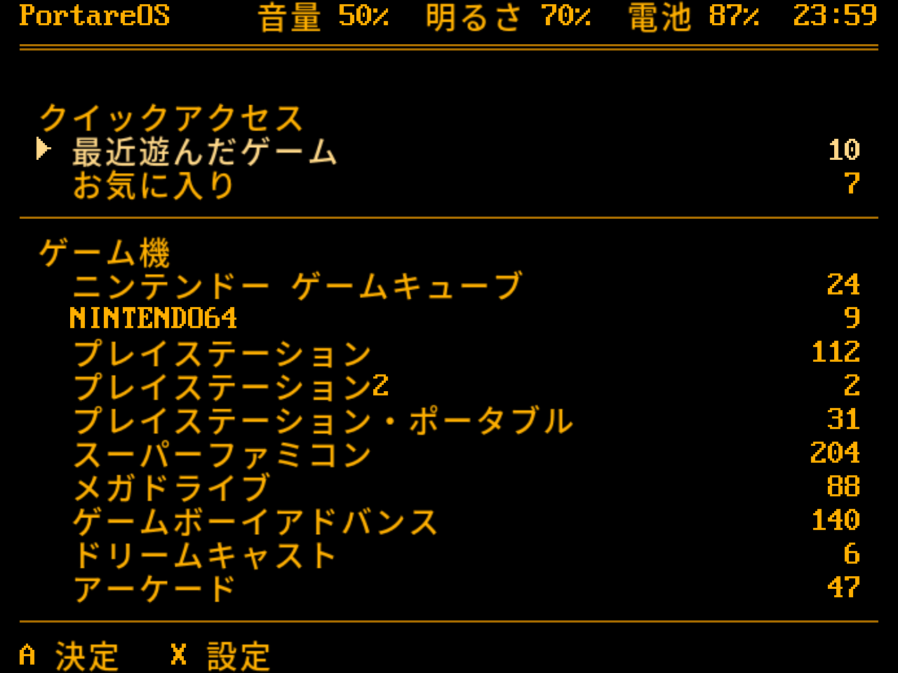
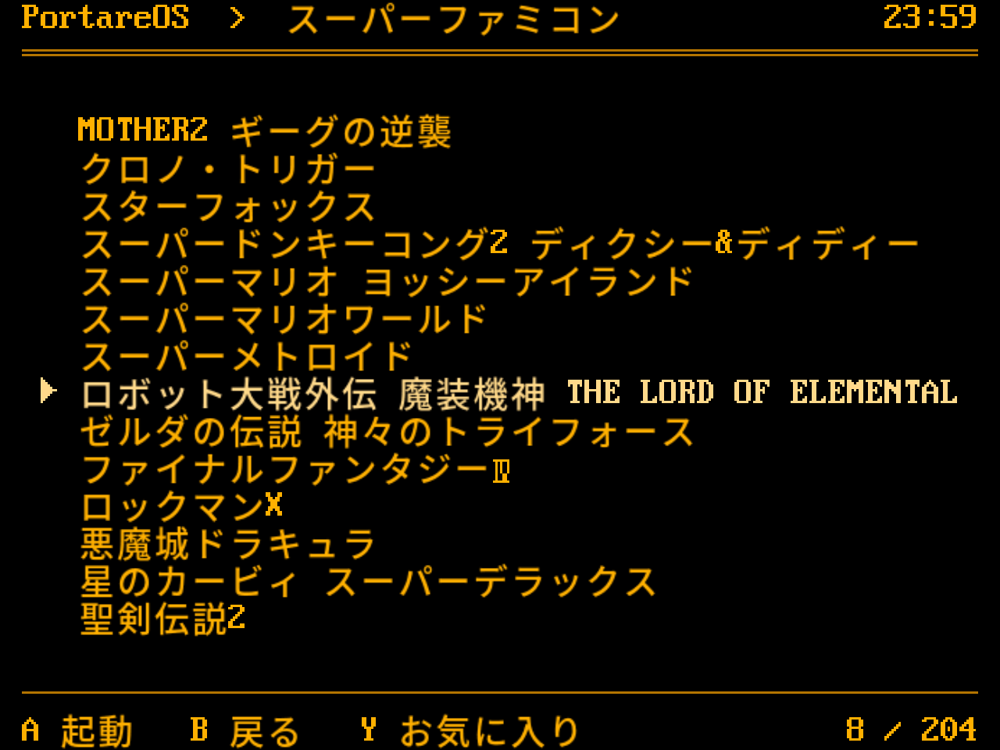
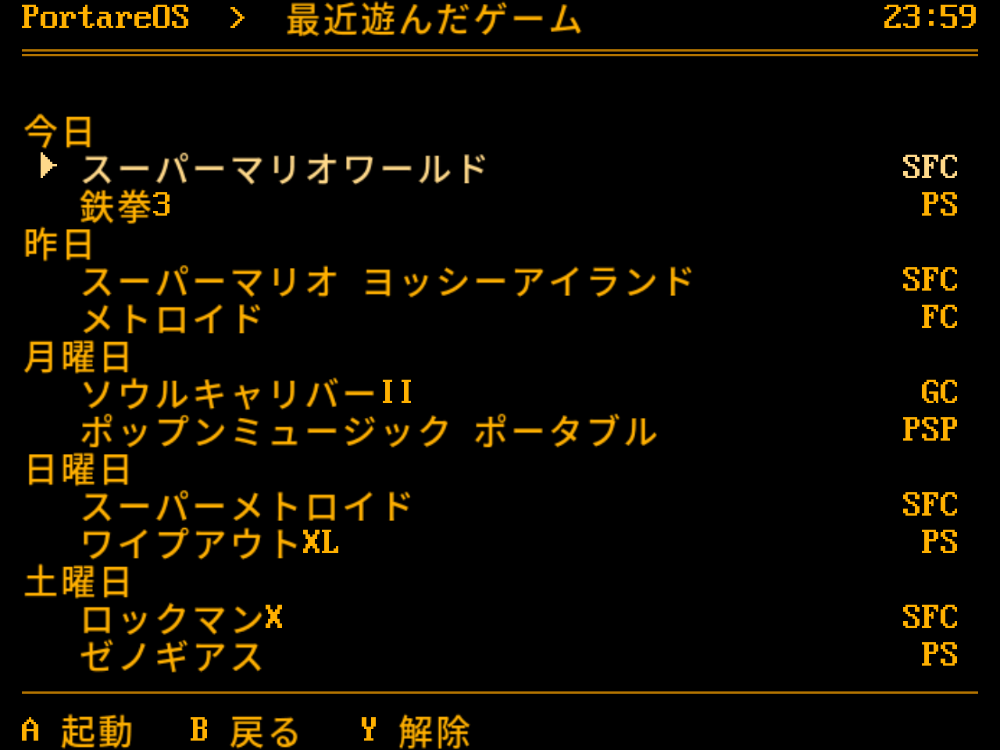
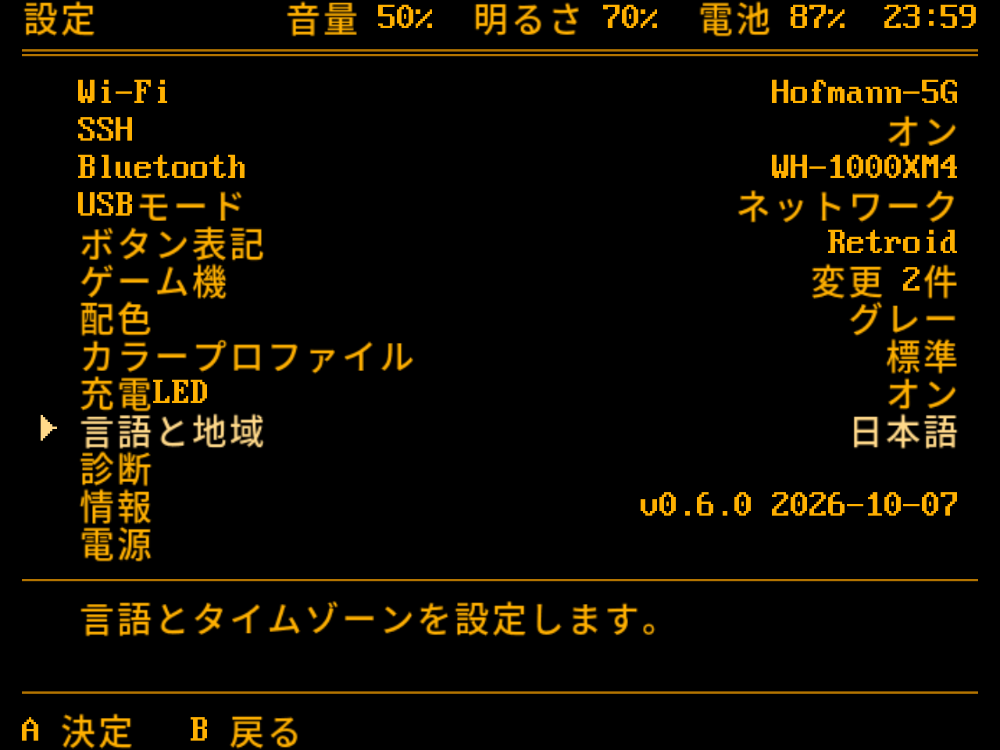
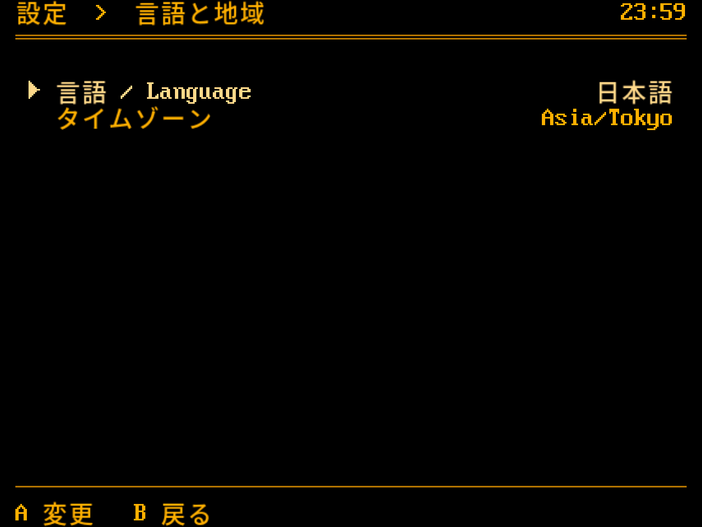
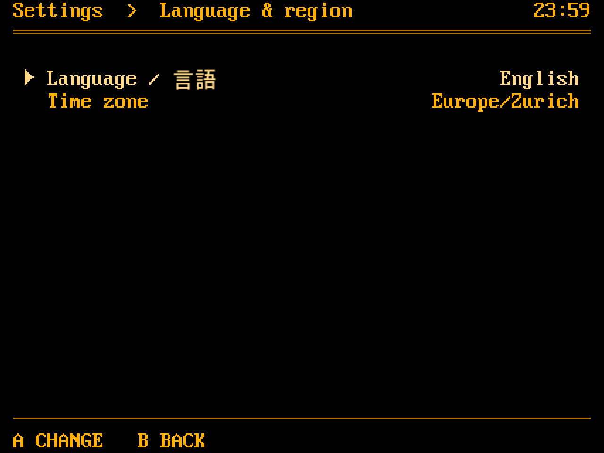
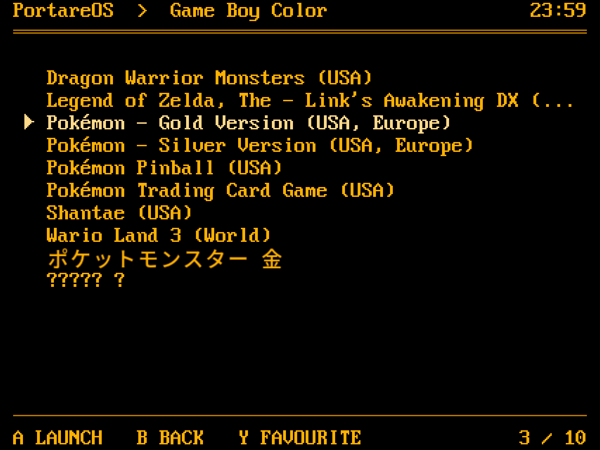

# Japanese

The launcher in English or Japanese, and in nothing else.

The pictures are `tools/mockup.py`'s screens, rendered by
`tools/mockup_png.py` with the launcher's font and the glyphs below. Both
follow the rules in this file, so a mockup shows what the rules produce.

## The setting

The language is `system.language` in system.cfg, `en_US` or `ja_JP`. It is
an existing key, so no second place says which language the device speaks.

Writing `ja_JP` changes nothing else. The only other reader is
`portareos-scraper` in the distribution, and nothing runs it: no package
builds the `sselph-scraper` it calls. If it ran, `ja_JP` would fall to its
default branch and scrape in English. Scraping names in Japanese would be a
deliberate change to that script, not a side effect of this one.

## The font

Kana and kanji are drawn the way the PS2 drew its system menus. The PS2's
font, `rom0:FONTM`, held each glyph at 26 x 26 pixels with 16 grey
levels, and the console scaled it with bilinear filtering and blended it
over the background (gsKit's `gsFontM.c` reads it so: a `GS_PSM_T4`
texture with a greyscale ramp, `GS_FILTER_LINEAR`). The launcher does the
same with a free font: Noto Sans CJK JP Medium, rasterised at 26 x 26
with 16 levels into `data/ja26.bin` by `tools/mkja26.py`, scaled to the
48 x 48 of two cells and blended into the cell's colour. Medium is the
weight that matches the VGA letters; Regular reads thin beside them.

Earlier tries are why. Unifont's 16 x 16 glyphs tripled showed
three-pixel stairs, which on this panel read as aliasing. Scale3x
smoothed them, and that was too smooth.

The file holds 13,636 glyphs, every two-cell character below, in 4.5 MB,
2 MB compressed; it is installed as
`/usr/share/portarelauncher/ja26.bin` with `ja26.NOTICE` and
`OFL-1.1.txt`. The program reads it at start. Without it, or for a
character it lacks, Unifont's glyph is drawn instead, which also covers
the one-cell symbols.

Unifont stays the source of what is drawn in what width. The set is every
character of JIS X 0213 the VGA font does not have,
with its `unifont_jp` glyph. Kana and kanji are 16 pixels wide and take
two cells. Some symbols and letters, such as Ⅳ, ※ and Ō, are 8 wide and
take one.

| Glyphs | Width | Source | Licence |
|---|---|---|---|
| 9,966 | 16 | Izumi16 | public domain |
| 3,670 | 16 | Unifont's own | GPL 2.0 or later with the GNU font embedding exception |
| 664 | 8 | Unifont's own | the same |

Unifont's own glyphs are dual-licensed, also under the SIL OFL 1.1; the
launcher takes the GPL option, which matches its own licence. The 14,300
glyphs are generated into `src/unifont.c` by `tools/mkunifont.py`, 446 KB
of bitmaps. Combining marks are left out, since they are always composed
or dropped. [FONTS.md](../FONTS.md) is the notice for both fonts.

The mockups carry only the glyphs they use: `tools/unifont-mockup.hex`,
cut by `tools/mkjafont.py` with the same rule, its header listing which
are Unifont's own, and `tools/ja26-mockup.hex` from `tools/mkja26.py`.
`tools/mockup_png.py` draws the latter in the same integer steps as the
launcher.

## Text

Strings and titles are UTF-8 and are decoded. Today every byte is drawn as
a CP437 glyph, so "Pokémon" comes out as "Pok├⌐mon".

Titles are composed to NFC when the catalog loads them. A file copied from
a Mac is named in decomposed form, `e` and U+0301, and a Japanese one can
carry the combining voiced mark U+3099. Composed, they are é and ガ. A
combining mark left over after composing is dropped.

Each character is drawn by the first of these that has it, and that
decides its width. There is no Unicode width table.

1. The VGA font: ASCII and the rest of CP437, so é, ü, ñ and the box
   drawing. One cell, through a fixed Unicode to CP437 map.
2. Unifont, for JIS X 0213: one cell or two, by the glyph's width. Ⅳ in
   ファイナルファンタジーⅣ is one.
3. The base letter of a composed character, if a font has that: ș as s.
4. Otherwise `?`, in one cell.

The English screen above shows all of it. One Pokémon is stored
decomposed and reads the same as the others. The Japanese title renders
under English menus. The Korean one has no glyphs, so each syllable is a
`?`.

A wide glyph fills two cells, and nothing ever draws half of one. Writing
over either half clears the other. A title cut to its column loses whole
characters.

## Scrolling

The marquee's position is in display columns, one per 150 ms tick. The
view starts at the character the position falls in, drawn whole. A
two-cell glyph therefore holds for two ticks and then leaves at once, so
text moves a column a tick on average in any script. Scrolling stops at the
first character boundary at or past the overflow, so the last character is
in view.

The code today counts bytes. `marquee_overflow` uses `strlen`, and
`row_label` starts the visible text at `name + off`, so a UTF-8 title would
be cut inside a character. Both become counts of display columns over
decoded characters.

## Order

Lists sort by code point: Latin first, then kana in their own order, then
kanji in no order a reader would expect, as in the games mockup. Readings
are not in the data: the catalog names a game by its file and does not
read gamelists.

## Words

Every launcher-owned UI string lives in one table per language, compiled
in. Titles, network and device names, time zone IDs, versions and
addresses come from outside and are drawn as they are. A test checks that
each owned string fits where it is drawn, in both languages, by width.

Console names are the ones Nintendo, Sony and Sega use in Japan:
スーパーファミコン, NINTENDO64, ニンテンドー ゲームキューブ, メガドライブ.
The short names in the cross-system lists follow, SFC and FC rather than
SNES and NES.

The hints keep the key letters and translate the verb. A enters with
決定 where it opens or confirms, and 変更 where it changes a value in place.
B is 戻る. Y is お気に入り, and 解除 to remove one; 削除 would read as
deleting the game.

## Settings

Settings stays at thirteen rows. Time zone becomes Language & region,
言語と地域, a submenu with the language and the time zone. Its value is
the language, named in its own script.

The language row names itself in both languages, `言語 / Language` and
`Language / 言語`, the one place that does. Whoever switched by mistake has
to find the way back without reading the language they switched to. The
values are each language in its own script, English and 日本語. A, left or
right switches, as Button style does, and the screen redraws in the new
language at once.

## Not part of it

- The on-screen keyboard stays Latin: it types Wi-Fi passwords and network
  names. Its hints are translated.
- PortScope keeps the kernel's event names and the labels printed on the
  device: L1, SELECT, HOME, START.
- Japanese input, other languages, RetroArch's own menu language, and
  scraping names in Japanese.

## Tests the implementation brings

- A UTF-8 title cut at the right edge, with a wide character across the
  last column.
- A right-aligned value beside Japanese text.
- Mixed ASCII and Japanese on one row.
- Pokémon, precomposed and decomposed, and ガ decomposed.
- A character no font has becoming `?`, ș becoming s, and Ⅳ taking one
  cell from Unifont.
- A wide glyph overwritten in either half, the other half cleared.
- The marquee over `MOTHER2 ギーグの逆襲`, tick by tick: ASCII a column a
  tick, each kana two ticks, stopping with the end in view.

## Open

Nothing. The stroke weight that was open here is settled by the font:
Noto Medium at 26 pixels matches the VGA letters, judged on the panel.
