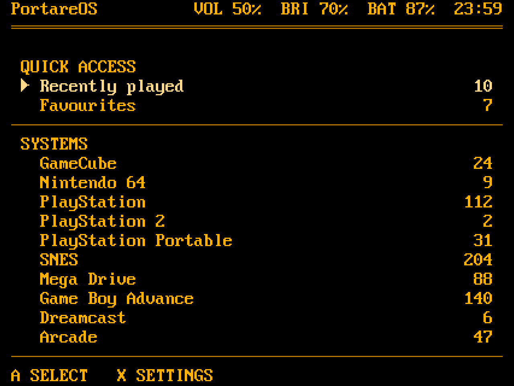
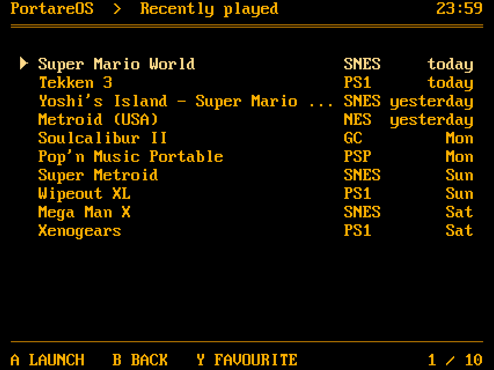
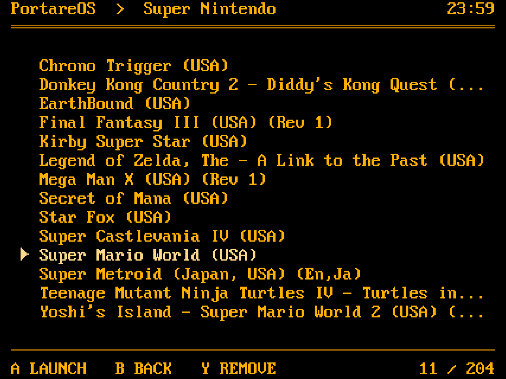
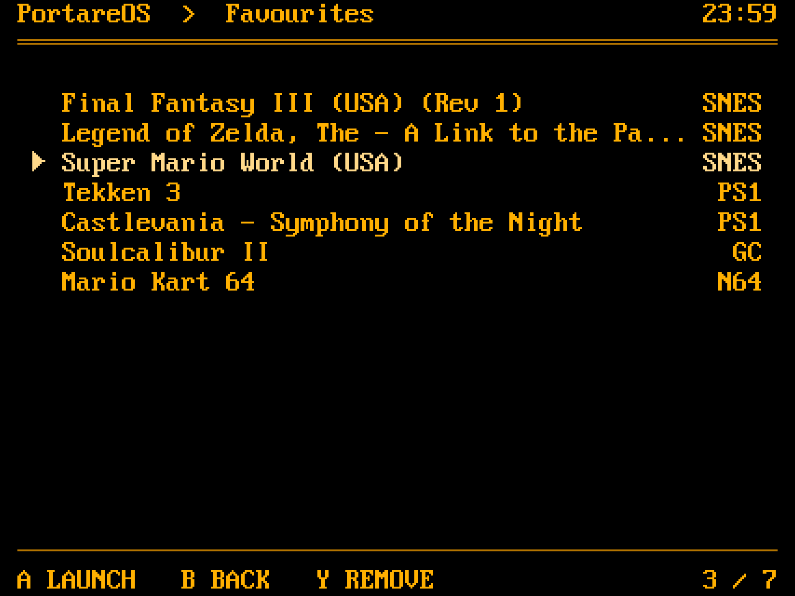
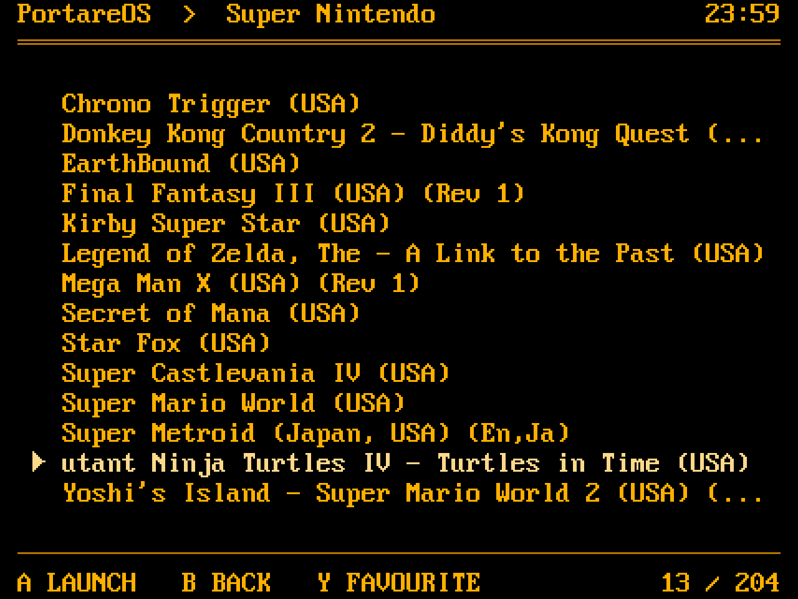

# Quick Access, Recently played, Favourites, long titles

A tester who filled several systems asked for a way back to a game
without scrolling the whole list, and for titles that do not stop at the
edge of the panel. The screens are in `docs/mockup.txt` under PROPOSED,
generated by `tools/mockup.py`, and rendered one image per screen in
`docs/images/` by `tools/mockup_png.py` from the same lists with the
launcher's own font, so what is shown is what the device can draw.

## Quick Access

A category of its own above the systems: cross-system shortcuts first,
platforms below, a thin rule between and no blank row. Recently played
comes first because it needs no curation. The systems section keeps its
title and loses its count: the list is the count. The plain Systems
screen without Quick Access drops the title row and the blank under it
altogether, two more systems on screen. The Systems screen keeps the device's status in
its header. A list of games, Recently played and Favourites included,
carries only its crumb and the clock at the right edge: no volume,
brightness or battery there, and no count of its rows, which the footer
has. The games screen no longer names the emulator under the
list; which core runs a system is not the player's concern.

## Recently played

Ten games, newest first. A row carries a short system name and the day:
`today`, `yesterday`, then the weekday. Short names (PS1, PS2, PSP, N64,
GBA, GC, DC, SNES, NES) in the cross-system views only; the Systems
screen keeps the full names. An entry is written when `runemu` exits
with status 0, so a game that never started is not in the list, and a
game quit with Home + Start is.

## Favourites

One file, a game path per line, in the launcher's config directory. It is
pruned of paths that no longer exist when it is read, so a renamed or
deleted ROM leaves no dead row. `Y` toggles the selected game wherever a
game is listed, and the footer is the cue: `Y FAVOURITE` under a game
that is not one, `Y REMOVE` under one that is, in every list. Nothing in
the list itself marks a favourite, and hints name keys and nothing else.

## Long titles

The title column is 47 characters once the marker, the indent and the
right margin are taken. A title longer than that is cut to the column with
`...` while it is not selected. The selected row scrolls instead: still
for one second, then one column to the left every 150 ms until the end is
in view, 1.5 seconds there, back to the start, and again. No wrap, so the
ending the reader was after is not followed by what they already read.
Only the selected row ever moves.

The position, `9 / 204`, sits at the right end of the footer where the
`↑↓ MOVE` hint was; a d-pad needs no hint. The row the count had, and the
blank rows around it, go to the list: fourteen games on screen instead of
ten.

