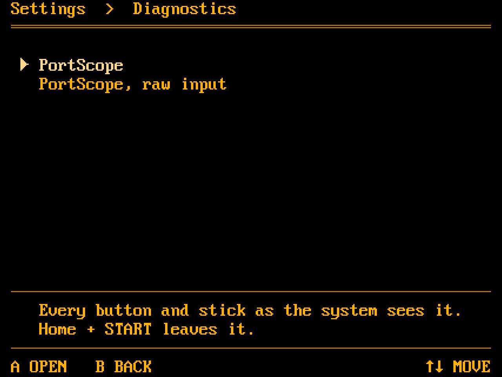
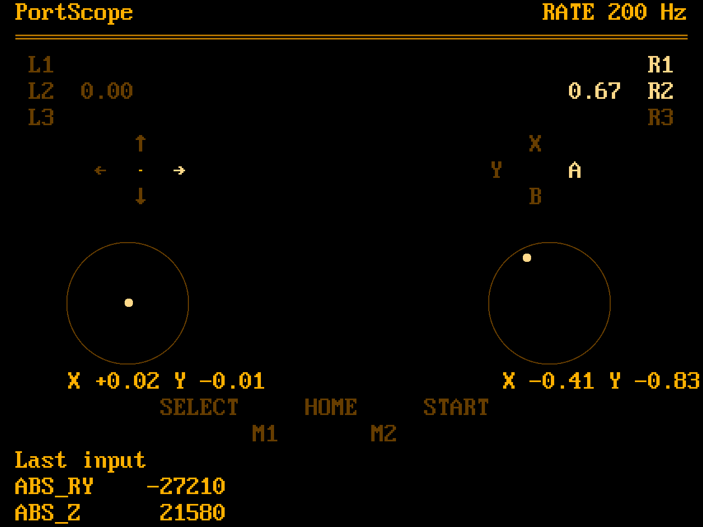
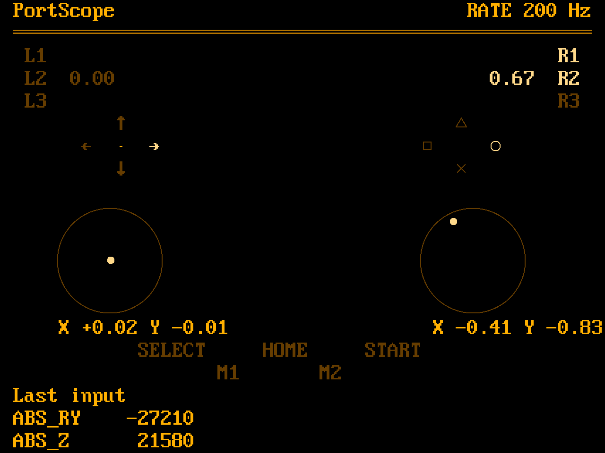

# PortScope

PortScope is input diagnostics of our own. It replaces the SDL
GamepadTester the image ships today, which needs SDL2_gfx and a controller
database and looks like nothing else on the device. This one is a second binary in this repository, built from
the launcher's own pieces: `kms.c` for the panel, the evdev reading of
`input.c`, the 8x16 font and the palette. No SDL, no database: it shows the
pad as the kernel reports it, and it looks like one more launcher screen.

It lives under Settings > Diagnostics, a submenu for the tools that show
what the hardware does, and nowhere in Tools: Tools is for scripts a user
dropped into the modules folder, this is part of the system.

The picture is `tools/mockup.py`'s `pad_screen`, at the launcher's 53x20
grid, rendered by `tools/mockup_png.py` with the launcher's font; a program
like the other mockups, so the layout cannot drift from what it claims.

## The one concession

A menu never needs a diagram; this does. The pad is drawn where its
controls sit: arrows for the D-pad and plain words for the rest out of the
font, and two things drawn as geometry at the panel's own resolution,
because the font cannot: a round ring for each stick's travel, since a
stick is round, with a dot for its position, and with the shape marks the
four face buttons as thin outlines, a circle, a triangle, a square and a
cross, never filled, at the letters' height. Nothing decorative: no enclosure, no
bevel, no second palette. A control is drawn with the
launcher's bright attribute while it is held and the dim one while it is
not, the values in body text, so whatever palette the launcher has, grey,
amber, green, PortScope has too.

The face buttons follow the button style setting, `launcher.buttons`:
the Retroid letters from the font, or the shape marks drawn as outlines.
The launcher's hint lines approximate those marks out of CP437 today;
drawing them gives both PortScope and the hints one proper set, two-pixel
lines in the current attribute.

## What it shows

- **L1 / R1**, bright while held.
- **L2 / R2** with their value, since the Nova's triggers are analog
  (`ABS_Z`, `ABS_RZ`).
- The **D-pad** arrows, the pressed one bright.
- **A B X Y** in the Nova's diamond, A on the right, B at the bottom.
- Each **stick** as a round ring with a dot that moves with the position
  and the normalised `X` and `Y` beneath. The dot moves in pixels, not
  cells. The click is `L3` or `R3` in the shoulder column, under `L2` and
  `R2`; label and ring go bright while the stick is clicked.
- **SELECT, HOME, START** and the paddles **M1, M2**.
- **Last input**: the last events as the kernel names them, code and
  value, in the rows a footer would have taken.
- In the header, `RATE` and the report rate of the device shown, measured
  from its events over the last second: the virtual pad's by default, the
  MCU's in raw mode. Whether the full rate survives the path to a game is
  what someone testing this device most often wants to know; the MCU
  itself reports at 200 Hz.

## One layer at a time

There are two devices to look at: the MCU's own evdev device, and the
virtual pad InputPlumber presents, which is what games get. Lighting a
control when either reports it would leave the reader unsure which layer
is under test, so PortScope shows one: the virtual pad by default, the
MCU's device after SELECT is held for a second, and back again the same
way. The header says ", raw" after the name while the MCU's device is
shown and nothing in the default case; what games see is the normal thing
to look at. `--raw` starts there. A short press of SELECT is a press like
any other and lights its word; only the hold switches. Diagnostics has
one entry, PortScope; the layer is a mode of it, not a second item.

InputPlumber grabs the devices it reads (`EVIOCGRAB`, in
`src/input/source/evdev/gamepad.rs`), so while it runs a second reader of
the MCU gets no events at all, and it has no call that lets one go. The
raw layer therefore stops `inputplumber.service`; InputPlumber puts the
hidden nodes back in `/dev/input` when it stops, and PortScope reads them
there. Leaving the raw layer starts it again, and so does every way out
of PortScope it controls. The launcher starts it once more after
PortScope returns, which covers the one way out that runs no code in
PortScope, a SIGKILL. While the raw layer is shown nothing else gets the
pad, which is the point of it.

The raw layer is two devices: the MCU, and gpio-keys, which carries the
paddles, BTN_Z for M1 and BTN_C for M2. The MCU reports the top face
button as BTN_WEST and the left one as BTN_NORTH; `nova_mcu.yaml` swaps
them for InputPlumber, and PortScope reads them the same way, so the
diagram stays where the buttons are and Last input shows the code the
MCU sent.

## What it does not do

No calibration, no remapping, no settings. `gamepadcalibration` keeps the
stick calibration; this only shows.

## Leaving

Home + START, the same combo that leaves every emulator: the launcher
holds it while a child runs (`quit.h`) and takes the panel back. PortScope
has no exit combo of its own and nothing says so, neither a footer here
nor a description on the Diagnostics screen; it is the way out of
everything on the device.

## In the distribution

`packages/apps/gamepadtester` goes, with its two SM8550 patches and the
Tools script and gamelist entry that ran it; nothing replaces them in
Tools. The launcher opens `/usr/bin/portscope` from Settings >
Diagnostics, so the package installs it beside `portarelauncher`.
`SDL2_gfx` was pulled in for the old tester and may go too once nothing
else lists it.
