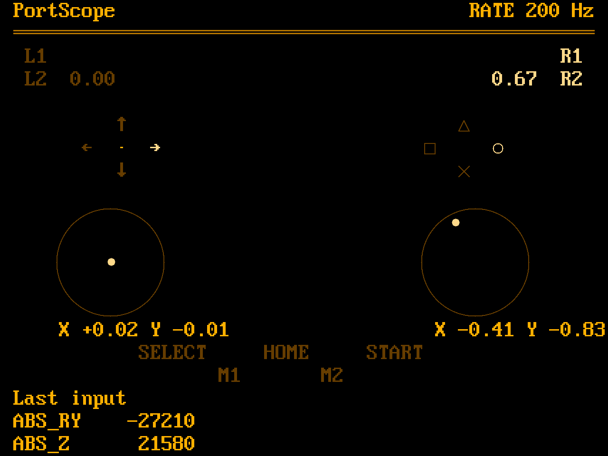

# PortScope

PortScope is a tool of our own to replace the SDL GamepadTester the image
ships today,
which needs SDL2_gfx and a controller database and looks like nothing else
on the device. This one is a second binary in this repository, built from
the launcher's own pieces: `kms.c` for the panel, the evdev reading of
`input.c`, the 8x16 font and the palette. No SDL, no database: it shows the
pad as the kernel reports it, and it looks like one more launcher screen.

The picture is `tools/mockup.py`'s `pad_screen`, at the launcher's 53x20
grid, rendered by `tools/mockup_png.py` with the launcher's font; a program
like the other mockups, so the layout cannot drift from what it claims.

## The one concession

A menu never needs a diagram; this does. The pad is drawn where its
controls sit: arrows for the D-pad and plain words for the rest out of the
font, and two things drawn as geometry at the panel's own resolution,
because the font cannot: a round ring for each stick's travel, since a
stick is round, with a dot for its position, and in the PS style the four
marks as thin outlines, a circle, a triangle, a square and a cross, never
filled, at the letters' height. Nothing decorative: no enclosure, no
bevel, no second palette. A control is drawn with the
launcher's bright attribute while it is held and the dim one while it is
not, the values in body text, so whatever palette the launcher has, grey,
amber, green, the tester has too.

The face buttons follow the button style setting, `launcher.buttons`:
the Retroid letters from the font, or the PS marks drawn as outlines. The
launcher's hint lines approximate those marks out of CP437 today; drawing
them gives both the tester and the hints one proper set, two-pixel lines
in the current attribute.

## What it shows

- **L1 / R1**, bright while held.
- **L2 / R2** with their value, since the Nova's triggers are analog
  (`ABS_Z`, `ABS_RZ`).
- The **D-pad** arrows, the pressed one bright.
- **A B X Y** in the Nova's diamond, A on the right, B at the bottom.
- Each **stick** as a round ring with a dot that moves with the position,
  and the normalised `X` and `Y` beneath. The dot moves in pixels, not
  cells; the ring goes bright while the stick is clicked (`L3`, `R3`).
- **SELECT, HOME, START** and the paddles **M1, M2**.
- **Last input**: the last events as the kernel names them, code and
  value, in the rows a footer would have taken.
- In the header, `RATE` and the pad's report rate, which is what a tester
  of this device most often wants to know (the MCU reports at 200 Hz).

## One layer at a time

There are two devices to look at: the MCU's own evdev device, and the
virtual pad InputPlumber presents, which is what games get. Lighting a
control when either reports it would leave the reader unsure which layer
is under test, so the tester shows one: the virtual pad by default, the
MCU's device when started with `--raw`, which the header then says with
", raw" after the name. Nothing is said in the default case; what games
see is the normal thing to look at. Tools can list both entries.

## What it does not do

No calibration, no remapping, no settings. `gamepadcalibration` keeps the
stick calibration; this only shows.

## Leaving

Home + START, the same combo that leaves every emulator: the launcher
holds it while a child runs (`quit.h`) and takes the panel back. PortScope
has no exit combo of its own and no footer saying so; the Tools
description carries it, as it does for every tool, and changes from
"hold L1, press START and SELECT" to "Home + START".

## In the distribution

`packages/apps/gamepadtester` goes, with its two SM8550 patches; the Tools
script runs the new binary, `portscope`, instead, and the entry is named
PortScope. `SDL2_gfx` was pulled
in for it and may go too once nothing else lists it.
